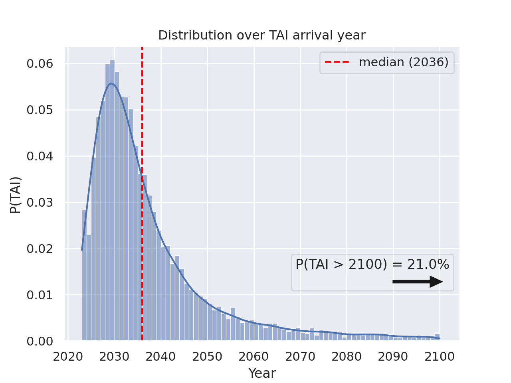

# TODO
  - [ ] Switch to Poetry
  - [ ] Note about what the project uses (Poetry, Docker, FastAPI)
  - [ ] Add instructions about how to install dependencies
  - [ ] Add instructions about how to run the model in standalone mode
  - [ ] Add instructions about how to run the server locally without Docker
  - [ ] Add instructions about Plots.ipynb

Backend of Epoch's [Direct Approach Interactive Model post](https://epochai.org/blog/direct-approach-interactive-model).



# Standalone execution

The easiest way to run the model is executing `run_standalone.py`. It will generate several graphs inside the `/plot` directory and print a summary of the output of the model.

```
$ python run_standalone.py

Probability of TAI by…
  2030: 29%
  2050: 69%
  2100: 79%

Quantile
  10%: 2026
  Median: 2036
  90%: >2100
```

# Deployment with Docker

If you want to run the server in the same way we're doing for our website, you might want to follow these steps:

```
cd timelines-direct-approach
sudo docker build -t direct-approach-backend .

# Stop and remove the old image (this might fail if one of those steps is unnecessary. That's fine.)
sudo docker stop timelines-backend; sudo docker rm timelines-backend

# Start the new image running
sudo docker run -dp 8000:8000 --name=timelines-backend direct-approach-backend

# Pipe the logs to stdout
sudo docker logs -f timelines-backend
```
